# my-GTFS-worker

A high-performance, Rust-based system designed to automatically fetch, decompress, and synchronize General Transit Feed Specification (GTFS) static datasets directly into a Cloudflare D1 Serverless Database.

It handles multiple Malaysian public transport operator datasets dynamically using the [Malaysia Open API](https://developer.data.gov.my/).

## Architecture

**Single codebase, multiple isolated instances.** The system consists of two cleanly separated Rust crates within a Cargo Workspace:
1. **`worker`**: A lightweight Cloudflare Worker compiled to WebAssembly that exposes HTTP endpoints (e.g., `/status`) to report on import progress.
2. **`importer`**: A standalone CLI designed to run in GitHub Actions. It downloads GTFS feeds, parses CSVs, and performs batch `INSERT` operations to Cloudflare D1 via the HTTP API concurrently.

```text
providers.toml          ← Single source of truth for all providers
    │
    ▼
generate-wrangler.sh    ← Generates wrangler.toml from providers.toml
    │
    ▼
wrangler.toml           ← AUTO-GENERATED (one [[d1_databases]] binding per provider)
    │
    ▼
deploy.sh               ← Provisions D1 DB + applies migrations + deploys worker
```

## Features

- ⚡ **Lightning Fast & Concurrent** — Written purely in Rust using `tokio` for asynchronous execution. Processes multiple CSV files and dispatches D1 queries in parallel.
- 📦 **In-Memory ZIP Processing** — Downloads and streams ZIP datasets directly in-memory, extracting CSV files (`routes.txt`, `stops.txt`, etc.) without touching disk.
- ⏯️ **Smart Resumability & Checkpointing** — Tracks dataset version via `ETag` and individual file changes via `CRC32`. Safely pauses and resumes interrupted imports using `LastProcessedLine`. Caps execution at a safe `MAX_ROWS_PER_RUN` limit to prevent hitting Cloudflare API rate limits.
- 🚀 **Concurrent Multi-Row Bulk Inserts** — Dynamically builds optimal batch sizing and dispatches them concurrently. Concurrency can be tuned via `D1_CONCURRENCY_LIMIT`.
- 🧵 **Decoupled Blocking Executor** — Isolates CPU-heavy Zip decompression and JSON parsing to a `tokio::task::spawn_blocking` pool, streaming JSON back to the async HTTP engine via MPSC channels to avoid executor starvation. Protected by a global `CSV_CONCURRENCY_LIMIT` semaphore to limit memory footprint.
- 🧠 **Explicit Deploy-Time Schema** — You manually manage the schema per-provider via explicit D1 migrations in `migrations/<provider>/`. The importer dynamically introspects your tables at runtime to insert the exact columns you defined.
- 🛡️ **Early Schema Validation** — Validates the entire GTFS ZIP against your explicitly defined schemas upfront. Completely bypasses parsing, database queries, and async task spawning for unsupported files, guaranteeing zero performance overhead for irrelevant GTFS data.
- 🔄 **Safe UPSERT Sync** — Uses `INSERT OR REPLACE INTO` instead of destructive `DELETE FROM`.
- ⏱️ **Zero-Maintenance Scheduling** — GitHub Actions cron triggers (`0 */1 * * *`) fire every 1 hours automatically.
- 🗄️ **Full Provider Isolation** — Each provider gets its own D1 database with bare GTFS table names.

---

## Project Structure

```text
my-GTFS-worker/
├── Cargo.toml          # Cargo Workspace definition
├── package.json        # Node dependencies (e.g., Wrangler CLI)
├── providers.toml      # Single source of truth for all provider instances
├── .env.example        # Example environment variables
├── generate-wrangler.sh # Generates wrangler.toml from providers.toml
├── deploy.sh           # Full lifecycle deployment script
├── wrangler.toml       # AUTO-GENERATED — do not edit directly
├── build.sh            # Rust compilation (called by wrangler [build].command)
├── importer/           # GitHub Actions Importer crate
│   ├── Cargo.toml
│   └── src/
│       ├── main.rs     # Entry point orchestrating multiple providers
│       ├── processor.rs# Core extraction, async concurrency, and D1 REST API sync logic
│       ├── d1.rs       # Cloudflare D1 API client with concurrency controls
│       └── config.rs   # Configuration loader
├── worker/             # Cloudflare Worker crate
│   ├── Cargo.toml
│   └── src/
│       └── lib.rs      # API entry points (/status)
├── migrations/         # D1 migration files for infrastructure tables
├── schema.sql          # Reference schema (not applied directly)
└── .github/workflows/  # GitHub Actions pipelines (e.g., run_importer.yml)
```

### Crate Responsibilities

| Crate | Purpose |
|---|---|
| `worker` | Deploys to Cloudflare Workers. Handles incoming HTTP requests to check database status via `/status`. |
| `importer` | Runs via GitHub Actions. Handles downloading ZIPs, upfront schema validation, concurrent CSV parsing, and parallel asynchronous multi-row batch inserts to D1. Tracks row progress to ensure resumability. |

### Data Flow

```mermaid
graph TD
    Start([GitHub Actions Cron]) --> Config[Load providers.toml]
    Config --> D1Init[Initialize D1Client & Global CSV Semaphore]
    
    D1Init -->|Iterate Active Providers| ProvSpawn
    
    subgraph "Provider Concurrency (All Providers Run Simultaneously)"
        ProvSpawn{tokio::spawn per Provider} --> ProvTask[process_provider]
        ProvTask --> Etag[HTTP HEAD: Check Etag]
        Etag -->|New Data| Download[Download GTFS .zip into Memory Bytes]
        Etag -->|No Change| CheckIncomplete{Any incomplete files?}
        CheckIncomplete -->|No| Skip[Skip Provider]
        CheckIncomplete -->|Yes: Resume| Download
        
        Download --> EarlySchemaCheck{Upfront Schema Validation & Filter}
        EarlySchemaCheck --> GetProgress[Query D1: Get All Files Progress]
        GetProgress --> FilterFiles{Check Resume State}
        
        FilterFiles -->|Spawn needed| CSVSpawn
        
        subgraph "File Concurrency (All CSVs Spawn Simultaneously)"
            CSVSpawn{tokio::spawn per File} --> CSVTask[process_csv_file]
            CSVTask --> SemAcquire((Acquire Global CSV Semaphore Permit))
            
            SemAcquire -->|Isolates CPU Work| ChannelSetup{Setup MPSC Channel}
            
            subgraph "Decoupled Processing (Prevents Tokio Starvation)"
                ChannelSetup -->|tokio::task::spawn_blocking| BlockingTask[Blocking Thread pool: Producer]
                BlockingTask --> Parse[Synchronous Zip Decompress & CSV parse]
                Parse --> JSON[Serialize to JSON Batches]
                
                ChannelSetup -->|Runs on Async Executor| AsyncTask[Async Thread: Consumer]
                
                JSON -.->|Sends Batch via Channel| AsyncTask
                
                AsyncTask --> Limit{Enforce D1 Concurrency Limit}
                Limit -->|Wait for available slot| Flush[batch_tasks.spawn]
                Flush --> HTTP[HTTP POST: Insert Batch to D1]
            end
            
            HTTP --> Join[Wait for all flushes to complete]
            Join --> Status[Update Final Status in D1]
        end
    end
```



---

## Prerequisites

Ensure your local environment is correctly configured with:

1. **[Rust & Cargo](https://rustup.rs/)** (`rustup default stable`)
2. **[Node.js / npm](https://nodejs.org/en/)**
3. **Wrangler CLI**: Install globally using `npm install -g wrangler`. (You can authenticate via `wrangler login`, or just use the `.env` file with your API token as shown below).
4. **Cloudflare Account**: Create an API Token with the following permissions:
   ```text
   Workers CI Write
   Workers CI Read
   D1 Read
   D1 Write
   Workers Tail Read
   Workers Scripts Write
   Workers Scripts Read
   Account Settings Read
   ```

---

## Setup

### 1. Environment Variables
Copy the provided example environment file and add your Cloudflare credentials:
```bash
cp .env.example .env
```
Then, edit `.env` and fill in `CLOUDFLARE_ACCOUNT_ID` and `CLOUDFLARE_API_TOKEN` (this allows you to skip `wrangler login`).

### 2. Add a Provider

All provider configuration lives in `providers.toml`. To add a new provider, simply add its block and leave `database_id` empty:

```toml
[[providers]]
name = "mybas-johor"
is_active = true
static_url = "https://api.data.gov.my/gtfs-static/"
static_provider = "mybas-johor"
database_id = ""   # ← Leave empty! deploy.sh will auto-fill this
```

*Note: You no longer need to manually run `wrangler d1 create` or set up the `migrations/` folder. `deploy.sh` will automatically provision the database, create an empty `migrations/` folder (if missing), and update your `providers.toml`.*

### 3. Deploy the Database and Worker

```bash
# Deploy all providers automatically (creates missing D1 databases, scaffolds schemas, generates wrangler.toml, and deploys worker)
./deploy.sh
```

The deploy script handles:
1. Iterates over all active providers (`is_active = true`) in `providers.toml`
2. Auto-provisions the D1 database if `database_id` is empty and updates `providers.toml`
3. Regenerates `wrangler.toml` dynamically
4. Creates an empty `migrations/` directory (if missing) and applies D1 migrations
5. Deploys the unified worker

### 4. Setup GitHub Actions
To start the automatic import pipeline:
1. Push your code to GitHub.
2. Add `CLOUDFLARE_ACCOUNT_ID` and `CLOUDFLARE_API_TOKEN` as Repository Secrets.
3. Add `D1_CONCURRENCY_LIMIT`, `MAX_ROWS_PER_RUN`, and `QUERY_STATEMENT_BATCH_SIZE` as Repository Variables.
4. The `.github/workflows/run_importer.yml` action will now automatically run every 1 hours.

---

## Development

```bash
# Start local development server for the worker (connects to your remote D1 database)
npx wrangler dev --remote
```

Visit `http://localhost:8787/<provider>/status` (e.g., `http://localhost:8787/mybas-johor/status`) to check the progress of your background imports!

To run the importer locally for testing:
```bash
set -a; source .env; set +a
cargo run --release -p importer
```

---

## Modifying or Adding a GTFS Table

If a provider adds a new column or table, or if you need to add an index:

1. **Update `0_gtfs_schema.sql`**: The Rust importer parses `migrations/<provider>/0_gtfs_schema.sql` at **build time** to determine which CSV columns to extract. You *must* add your new column to this file.
2. **Create a new D1 migration**: Because D1 ignores changes to already-applied migrations, you must also create a new migration to actually alter the database:
   ```bash
   npx wrangler d1 migrations create DB_<PROVIDER_NAME_UPPERCASE> add_new_column
   ```
3. **Add your SQL** (e.g., `ALTER TABLE ... ADD COLUMN ...`) to the newly generated file in `migrations/<provider>/<timestamp>_add_new_column.sql`.
4. **Apply the migration** by running `./deploy.sh` (or `npx wrangler d1 migrations apply ...`).

Because the schema is parsed dynamically at compile time, no Rust code changes are required! The next time your GitHub Action runs, it will recompile the importer and automatically start mapping the new column from the CSV.
