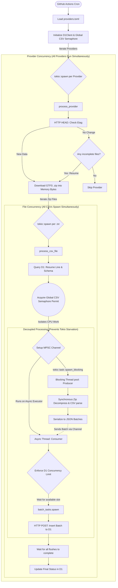

# my-GTFS-worker

A high-performance, Rust-based system designed to automatically fetch, decompress, and synchronize General Transit Feed Specification (GTFS) static datasets directly into a Cloudflare D1 Serverless Database.

It handles multiple Malaysian public transport operator datasets dynamically using the [Malaysia Open API](https://developer.data.gov.my/).

## Architecture

**Single codebase, multiple isolated instances.** The system consists of two cleanly separated Rust crates within a Cargo Workspace:
1. **`worker`**: A lightweight Cloudflare Worker compiled to WebAssembly that exposes HTTP endpoints (e.g., `/status`) to report on import progress.
2. **`importer`**: A standalone CLI designed to run in GitHub Actions. It downloads GTFS feeds, parses CSVs, and performs batch `INSERT` operations to Cloudflare D1 via the HTTP API concurrently.

```text
providers.toml          ← Single source of truth for all providers
    │
    ▼
generate-wrangler.sh    ← Generates wrangler.toml from providers.toml
    │
    ▼
wrangler.toml           ← AUTO-GENERATED (one [env.*] block per provider)
    │
    ▼
deploy.sh <provider>    ← Provisions D1 DB + applies migrations + deploys worker
```

## Features

- ⚡ **Lightning Fast & Concurrent** — Written purely in Rust using `tokio` for asynchronous execution. Processes multiple CSV files and dispatches D1 queries in parallel.
- 📦 **In-Memory ZIP Processing** — Downloads and streams ZIP datasets directly in-memory, extracting CSV files (`routes.txt`, `stops.txt`, etc.) without touching disk.
- ⏯️ **Smart Resumability & Checkpointing** — Tracks dataset version via `ETag` and individual file changes via `CRC32`. Safely pauses and resumes interrupted imports using `LastProcessedLine`. Caps execution at a safe `MAX_ROWS_PER_RUN` limit to prevent hitting Cloudflare API rate limits.
- 🚀 **Concurrent Multi-Row Bulk Inserts** — Dynamically builds optimal batch sizing and dispatches them concurrently. Concurrency can be tuned via `D1_CONCURRENCY_LIMIT` (default 5).
- 🧵 **Decoupled Blocking Executor** — Isolates CPU-heavy Zip decompression and JSON parsing to a `tokio::task::spawn_blocking` pool, streaming JSON back to the async HTTP engine via MPSC channels to avoid executor starvation. Protected by a global `CSV_CONCURRENCY_LIMIT` semaphore to limit memory footprint.
- 🧠 **Explicit Deploy-Time Schema** — You manually manage the schema per-provider via D1 migrations (`migrations/<provider>/<timestamp>_gtfs_schema.sql`). The importer dynamically introspects your tables at runtime to insert the exact columns you defined.
- 🔄 **Safe UPSERT Sync** — Uses `INSERT OR REPLACE INTO` instead of destructive `DELETE FROM`.
- ⏱️ **Zero-Maintenance Scheduling** — GitHub Actions cron triggers (`0 */1 * * *`) fire every 1 hours automatically.
- 🗄️ **Full Provider Isolation** — Each provider gets its own D1 database with bare GTFS table names.

---

## Project Structure

```text
my-GTFS-worker/
├── Cargo.toml          # Cargo Workspace definition
├── providers.toml      # Single source of truth for all provider instances
├── generate-wrangler.sh # Generates wrangler.toml from providers.toml
├── deploy.sh           # Full lifecycle deployment script
├── wrangler.toml       # AUTO-GENERATED — do not edit directly
├── build.sh            # Rust compilation (called by wrangler [build].command)
├── importer/           # GitHub Actions Importer crate
│   ├── Cargo.toml
│   └── src/
│       ├── main.rs     # Entry point orchestrating multiple providers
│       ├── processor.rs# Core extraction, async concurrency, and D1 REST API sync logic
│       ├── d1.rs       # Cloudflare D1 API client with concurrency controls
│       └── config.rs   # Configuration loader
├── worker/             # Cloudflare Worker crate
│   ├── Cargo.toml
│   └── src/
│       └── lib.rs      # API entry points (/status)
├── migrations/         # D1 migration files for infrastructure tables
├── schema.sql          # Reference schema (not applied directly)
└── .github/workflows/  # GitHub Actions pipelines (e.g., gtfs_import.yml)
```

### Crate Responsibilities

| Crate | Purpose |
|---|---|
| `worker` | Deploys to Cloudflare Workers. Handles incoming HTTP requests to check database status via `/status`. |
| `importer` | Runs via GitHub Actions. Handles downloading ZIPs, concurrent CSV parsing, dynamic schema matching, and parallel asynchronous multi-row batch inserts to D1. Tracks row progress to ensure resumability. |

### Data Flow



---

## Prerequisites

Ensure your local environment is correctly configured with:

1. **[Rust & Cargo](https://rustup.rs/)** (`rustup default stable`)
2. **[Node.js / npm](https://nodejs.org/en/)**
3. **Wrangler CLI**: Install globally using `npm install -g wrangler`, and then authenticate your account by running `wrangler login`.
4. **Cloudflare Account**

---

## Setup

### 1. Add a Provider

All provider configuration lives in `providers.toml`. To add a new provider, simply add its block and leave `database_id` empty:

```toml
[[providers]]
name = "mybas-johor"
static_url = "https://api.data.gov.my/gtfs-static/"
static_provider = "mybas-johor"
database_id = ""   # ← Leave empty! deploy.sh will auto-fill this
```

*Note: You no longer need to manually run `wrangler d1 create` or set up the `migrations/` folder. `deploy.sh` will automatically provision the database, scaffold the `migrations/` folder using `schema.sql` as a template, and update your `providers.toml`.*

### 2. Deploy the Database and Worker

```bash
# Deploy all providers automatically (creates missing D1 databases, scaffolds schemas, generates wrangler.toml, and deploys worker)
./deploy.sh
```

The deploy script handles:
1. Validates the provider exists in `providers.toml`
2. Auto-provisions the D1 database if `database_id` is empty
3. Regenerates `wrangler.toml`
4. Scaffolds `migrations/` from `schema.sql` (if missing) and applies D1 migrations
5. Deploys the worker

### 3. Setup GitHub Actions
To start the automatic import pipeline:
1. Push your code to GitHub.
2. Add `CLOUDFLARE_ACCOUNT_ID` and `CLOUDFLARE_API_TOKEN` as Repository Secrets.
3. The `.github/workflows/gtfs_import.yml` action will now automatically run every 4 hours.

---

## Development

```bash
# Start local development server for the worker (connects to your remote D1 database)
npx wrangler dev --env mybas-johor --remote
```

Visit `http://localhost:8787/status` to check the progress of your background imports!

To run the importer locally for testing:
```bash
export CLOUDFLARE_ACCOUNT_ID="your_account_id"
export CLOUDFLARE_API_TOKEN="your_api_token"
export D1_CONCURRENCY_LIMIT=5 # Optional: Set D1 parallel requests limit
cargo run --release -p importer
```

---

## Modifying or Adding a GTFS Table

If a provider adds a new column or table, or if you need to add an index:

1. **Update the provider's migration file** in `migrations/<provider>/<timestamp>_gtfs_schema.sql` (or create a new migration).
2. **Apply the migration**:
   ```bash
   wrangler d1 migrations apply DB --env <provider> --remote
   ```

The importer dynamically uses `PRAGMA table_info()` at runtime, so it will automatically discover any new columns you add to your schema and map them from the CSV! No Rust code changes are required for new tables.
