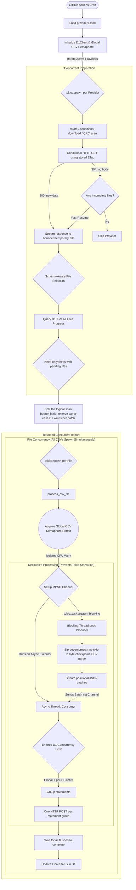

# my-GTFS-worker

A high-performance, Rust-based system designed to automatically fetch, decompress, and synchronize General Transit Feed Specification (GTFS) static datasets directly into a Cloudflare D1 Serverless Database.

It handles multiple Malaysian public transport operator datasets dynamically using the [Malaysia Open API](https://developer.data.gov.my/).

## Architecture

**Single codebase, multiple isolated instances.** The system consists of two cleanly separated Rust crates within a Cargo Workspace:

1. **`worker`**: A lightweight Cloudflare Worker compiled to WebAssembly that exposes `/<provider>/status` endpoints to report on import progress.
2. **`importer`**: A standalone CLI designed to run in GitHub Actions. It downloads GTFS feeds, parses CSVs, and performs batch `INSERT` operations to Cloudflare D1 via the HTTP API concurrently.

```text
providers.toml          ← Single source of truth for all providers
    │
    ▼
scripts/generate-wrangler.sh    ← Generates wrangler.toml from providers.toml
    │
    ▼
wrangler.toml           ← AUTO-GENERATED (one [[d1_databases]] binding per provider)
    │
    ▼
scripts/deploy.sh               ← Provisions D1 DB + applies migrations + deploys worker
```

## Features

- ⚡ **Quota-Aware Bounded Concurrency** — Divides one workflow-wide row allowance fairly among feeds with pending work, redistributes unused shares in work-conserving waves, and enforces separate global, per-database, and blocking CSV-producer limits.
- 📦 **Bounded-Memory ZIP Streaming** — Streams each HTTP response to an automatically cleaned temporary file with a configurable size ceiling. Concurrent provider feeds no longer accumulate in heap memory.
- ⏯️ **Safe Resumability & Checkpointing** — Uses conditional GETs with `ETag`, per-file `CRC32`, and contiguous committed row-plus-byte checkpoints. Resumes decompress to the saved boundary without reparsing earlier CSV records, including records with quoted newlines. A dataset version is recorded only after every file completes.
- 🚀 **Compact Batched Inserts** — Streams positional JSON arrays without building a per-row JSON object tree, inserts many rows through `json_each(?)`, and groups multiple statements into each D1 REST request.
- 🧵 **Decoupled Blocking Executor** — Isolates ZIP decompression, CSV parsing, and JSON encoding on `tokio::task::spawn_blocking`. The CSV semaphore covers only the blocking producer lifetime; bounded MPSC channels provide backpressure to asynchronous uploads.
- 🧠 **Compile-Time Schema Discovery** — Per-provider `0_gtfs_schema.sql` files generate static Rust column maps at build time, with no runtime `PRAGMA` or schema-probe query.
- 🛡️ **Schema-Aware File Selection** — Uses the generated provider schema to reject unsupported ZIP entries before CSV parsing or task spawning. CI separately validates live feed headers and local migration chains.
- 🔄 **Write-Eliding UPSERT Imports** — Uses a null-safe conditional `ON CONFLICT DO UPDATE` so replaying a committed range is safe while identical rows cause no database changes. Rows removed from an upstream snapshot are not deleted automatically.
- 📊 **D1 Usage Telemetry** — Aggregates Cloudflare's per-query `rows_read` and `rows_written` metadata and reports actual usage at the end of each workflow.
- 🌐 **Edge-Cached Status API** — Canonicalizes status URLs and caches successful JSON responses for 60 seconds so repeated public requests do not repeatedly consume D1 reads.
- ⏱️ **Twice-Daily Feed Checks** — GitHub Actions cron (`0 5,13 * * *`) checks feeds at 05:00 and 13:00 UTC+8 (timezone: "Asia/Kuala_Lumpur"); a durable daily write budget also covers manual runs.
- 🧾 **Auditable Rotation History** — Automatic rotation records the retired database name, UUID, provider, and timestamp in `providers.toml`; old databases remain available for explicit archive/delete operations.
- 🗄️ **Full Provider Isolation** — Each provider gets its own D1 database with bare GTFS table names.

---

## Project Structure

```text
my-GTFS-worker/
├── Cargo.toml          # Cargo Workspace definition
├── package.json        # Node dependencies (e.g., Wrangler CLI)
├── providers.toml      # Single source of truth for all provider instances
├── .env.example        # Example environment variables
├── wrangler.toml       # AUTO-GENERATED — do not edit directly
├── scripts/            # Shell scripts for build & deployment
│   ├── generate-wrangler.sh # Generates wrangler.toml from providers.toml
│   ├── deploy.sh       # Full lifecycle deployment script
│   └── build.sh        # Rust compilation (called by wrangler [build].command)
├── importer/           # GitHub Actions Importer crate
│   ├── Cargo.toml
│   └── src/
│       ├── main.rs     # Entry point orchestrating multiple providers
│       ├── processor.rs# Core extraction, async concurrency, and D1 REST API sync logic
│       ├── d1.rs       # Cloudflare D1 API client with concurrency controls
│       └── config.rs   # Configuration loader
├── worker/             # Cloudflare Worker crate
│   ├── Cargo.toml
│   └── src/
│       └── lib.rs      # API entry points (/status)
├── migrations/         # D1 migration files for infrastructure tables
├── schema.sql          # Reference schema (not applied directly)
└── .github/workflows/  # GitHub Actions pipelines (e.g., run_importer.yml)
```

### Crate Responsibilities

| Crate      | Purpose                                                                                                                                                                                                      |
| ---------- | ------------------------------------------------------------------------------------------------------------------------------------------------------------------------------------------------------------ |
| `worker`   | Deploys to Cloudflare Workers. Handles incoming HTTP requests to check database status via `/<provider>/status`.                                                                                             |
| `importer` | Runs via GitHub Actions. Handles downloading ZIPs, schema-aware file selection, concurrent CSV parsing, and parallel asynchronous multi-row batch inserts to D1. Tracks row progress to ensure resumability. |

### Data Flow


```mermaid
graph TD
    Start([GitHub Actions Cron]) --> Config[Load providers.toml]
    Config --> D1Init[Initialize D1Client & Global CSV Semaphore]

    D1Init -->|Iterate Active Providers| PrepareSpawn

    subgraph "Concurrent Preparation"
        PrepareSpawn{tokio::spawn per Provider} --> Prepare[rotate / conditional download / CRC scan]
        Prepare --> Etag[Conditional HTTP GET using stored ETag]
        Etag -->|200: new data| Download[Stream response to bounded temporary ZIP]
        Etag -->|304: no body| CheckIncomplete{Any incomplete files?}
        CheckIncomplete -->|No| Skip[Skip Provider]
        CheckIncomplete -->|Yes: Resume| Download

        Download --> EarlySchemaCheck{Schema-Aware File Selection}
        EarlySchemaCheck --> GetProgress[Query D1: Get All Files Progress]
        GetProgress --> FilterFiles{Keep only feeds with pending files}
    end

    FilterFiles --> FairBudget[Split the logical scan budget fairly; reserve worst-case D1 writes per batch]
    FairBudget --> CSVSpawn

    subgraph "Bounded Concurrent Import"

        subgraph "File Concurrency (All CSVs Spawn Simultaneously)"
            CSVSpawn{tokio::spawn per File} --> CSVTask[process_csv_file]
            CSVTask --> SemAcquire((Acquire Global CSV Semaphore Permit))

            SemAcquire -->|Isolates CPU Work| ChannelSetup{Setup MPSC Channel}

            subgraph "Decoupled Processing (Prevents Tokio Starvation)"
                ChannelSetup -->|tokio::task::spawn_blocking| BlockingTask[Blocking Thread pool: Producer]
                BlockingTask --> Parse[Zip decompress; raw-skip to byte checkpoint; CSV parse]
                Parse --> JSON[Stream positional JSON batches]

                ChannelSetup -->|Runs on Async Executor| AsyncTask[Async Thread: Consumer]

                JSON -.->|Sends Batch via Channel| AsyncTask

                AsyncTask --> Limit{Enforce D1 Concurrency Limit}
                Limit -->|Global + per-DB limits| Flush[Group statements]
                Flush --> HTTP[One HTTP POST per statement group]
            end

            HTTP --> Join[Wait for all flushes to complete]
            Join --> Status[Update Final Status in D1]
        end
    end
```

---

## Prerequisites

Ensure your local environment is correctly configured with:

1. **[Rust & Cargo](https://rustup.rs/)** (the repository pins Rust `1.94.0`)
2. **[Node.js / npm](https://nodejs.org/en/)**
3. **Wrangler CLI**: Install globally using `npm install -g wrangler`. (You can authenticate via `wrangler login`, or just use the `.env` file with your API token as shown below).
4. **Cloudflare Account**: Create an API Token with the following permissions:
   ```text
   Workers CI Write
   Workers CI Read
   D1 Read
   D1 Write
   Workers Tail Read
   Workers Scripts Write
   Workers Scripts Read
   Account Settings Read
   ```

---

## Setup

### 1. Environment Variables

Copy the provided example environment file and add your Cloudflare credentials:

```bash
cp .env.example .env
```

Then, edit `.env` and fill in `CLOUDFLARE_ACCOUNT_ID` and `CLOUDFLARE_API_TOKEN` (this allows you to skip `wrangler login`).

The checked-in `.env.example` profile uses high scan concurrency. Both direct and scheduled imports must acquire capacity from the shared daily write ledger.

| Variable                           | Example value | Purpose                                                                                                     |
| ---------------------------------- | ------------: | ----------------------------------------------------------------------------------------------------------- |
| `CSV_CONCURRENCY_LIMIT`            |            20 | Concurrent blocking ZIP/CSV producers; an unset local value detects CPUs                                    |
| `D1_CONCURRENCY_LIMIT`             |            10 | Concurrent D1 REST requests across the account (one per active database)                                    |
| `D1_DATABASE_CONCURRENCY_LIMIT`    |             8 | Concurrent requests permitted to one D1 database                                                            |
| `D1_MAX_DATABASES`                 |            20 | Refuse automatic rotation once the configured account database count is exhausted                           |
| `QUERY_STATEMENT_BATCH_SIZE`       |          2000 | CSV rows encoded in one SQL statement                                                                       |
| `D1_STATEMENTS_PER_REQUEST`        |             8 | SQL statements grouped into one REST request                                                                |
| `MAX_D1_ROWS_WRITTEN_PER_WORKFLOW` |        100000 | Maximum daily-ledger lease, including data, metadata and ledger writes; capped by the remaining daily allowance |
| `MAX_ROWS_PER_WORKFLOW`            |       5000000 | Logical scan ceiling shared fairly by providers, independent of actual writes                               |
| `MAX_FEED_DOWNLOAD_MB`             |           256 | Reject a declared or streamed ZIP larger than this temporary-file safety limit                              |
| `MAX_UNCOMPRESSED_FEED_MB`         |           512 | Reject supported CSV entries whose combined declared expansion exceeds this ZIP-bomb/work cap               |
| `MAX_CSV_RECORD_KB`                |           512 | Reject pathological CSV headers/records well below D1's 2,000,000-byte value limit                          |
| `MAX_STATEMENT_PAYLOAD_KB`         |          1536 | Flush serialized positional-JSON bind values below D1's 2,000,000-byte hard limit                           |
| `MAX_TEMP_FEED_STORAGE_MB`         |          2048 | Workflow-wide cap for all retained provider ZIPs in one importer process; must be at least the per-feed cap |
| `DB_SIZE_THRESHOLD_MB`             |           490 | Rotation threshold with minimal headroom below the documented 500 MB database limit                         |

`MAX_ROWS_PER_RUN` remains a deprecated fallback when invoking the importer directly, but its value now has workflow-wide semantics. The checked-in GitHub workflow deliberately ignores that legacy repository variable so an old 100,000-row setting cannot silently reintroduce the non-converging scan cap; configure `MAX_ROWS_PER_WORKFLOW` instead.

### Daily operating envelope

As of 2026-08-28, D1 Free includes 100,000 rows written and 5 million rows read per account per UTC day, 500 MB per database, 10 databases, and 5 GB total storage. Indexed writes count toward the write allowance as additional rows. See Cloudflare's [D1 pricing](https://developers.cloudflare.com/d1/platform/pricing/) and [platform limits](https://developers.cloudflare.com/d1/platform/limits/).

The importer reserves up to the configured workflow allowance atomically in `daily_import_budget` before preparing providers, using the remaining daily capacity when a full allowance cannot fit. The daily importer ceiling is 100,000 writes, with no allowance set aside for other account activity. `budget_provider` in `providers.toml` selects the existing database that holds this shared ledger. All importer deployments for the account must use the same ledger; external writers and old importer binaries are not accounted for automatically. Never reset or move the ledger during an active UTC day. Automatic rotation of its database is blocked to preserve accounting.

The default maximum 100,000-write lease includes 1,000 writes allocated to metadata and two ledger writes, leaving up to 98,998 for data. These writes count within the daily allowance. The workflow inherits this default from the importer unless its repository variable overrides it. Each file reserves its checkpoint before uploading. Data batches reserve two writes per logical row and reconcile against `meta.rows_written`; unchanged rows return capacity immediately. Completed runs return only provably unused capacity, which later runs can lease on the same day. A crash or ambiguous write consumes its reservation; mutating requests are not automatically retried. If the remaining daily capacity cannot cover metadata, ledger writes and any data, the run exits without importing. The ledger resets on the first admission of a new UTC day. Requests stop during the final minute of the leased day and cannot spend an old lease after midnight; a boundary interruption may leave checkpoints to be replayed on the next run.

Before using the new importer, apply `migrations/ktmb/20260912_add_daily_import_budget.sql` through `./scripts/deploy.sh` and rebuild the importer release. Missing ledger tables fail closed. The daily ceiling and metadata reserves are defined in `importer/src/d1.rs`; workflow settings cannot raise the daily ceiling. Table-level batch logs report provider, table, logical rows and actual D1 writes. Keep necessary indexes: UPSERTs omit primary-key assignments while retaining null-safe comparisons for mutable columns.

The six feeds contained 1,562,132 source rows when measured on 2026-08-28. An earlier fixed 40,000-logical-row daily limit therefore needed at least 39 days for one scan and could restart large files faster than it completed them. The workflow fallback's separate 1,750,000-row logical ceiling now lets a mostly unchanged snapshot traverse in one workflow, while a full 100,000-write lease allows up to 49,499 indexed source rows for a changed or initial load. Batch reservations can stop earlier when the next batch does not fit. The final `D1 query metadata` log totals successfully decoded responses; use the Cloudflare dashboard as the account-wide authority for the full UTC day.

Compressed downloads, retained temporary ZIPs, archive entry counts, declared uncompressed CSV bytes, individual CSV records, and serialized SQL parameter payloads are all bounded independently. The current six live feeds expand to less than 50 MB each (largest observed on 2026-08-28), so the 512 MB default leaves substantial growth headroom while preventing a malformed or hostile archive from turning a small download into an unbounded CPU/memory workload. The 1.5 MiB statement cap also bounds the workflow fallback's four-statement REST batch near 6 MiB before HTTP framing and remains below D1's maximum string-value size.

Imports intentionally do not delete rows omitted by a later upstream snapshot. Correct deletion across resumable, multi-workflow imports requires generation tracking or staging tables, which would add at least one persistent write per source row and consume more of the daily write allowance. Do not replace this with a pre-import `DELETE`: that would expose partial datasets while a capped import is in progress. If exact snapshot replacement is required, provision additional write/storage capacity and implement an atomic staging-generation swap.

The workflow fallback's 400 MB rotation threshold limits ten retained databases to at most about 4 GB, leaving storage headroom below the 5 GB account limit. The aggressive `.env.example` profile instead rotates at 490 MB and permits 20 databases, so it relies on the observed Cloudflare headroom rather than the documented Free-tier storage envelope. Rotation is serialized across providers. Every successful rotation appends a `[[retired_databases]]` record to `providers.toml`, so the old name and UUID are not orphaned. Old databases are intentionally not deleted automatically: export a recorded name with `npx wrangler d1 export <name> --remote --output <archive.sql>`, verify the archive, then explicitly delete that database before retrying a blocked rotation.

The import job has a 10-minute timeout and runs twice daily, allowing up to 620 scheduled Linux runner minutes in a 31-day month, excluding builds and manual runs. Manual dispatches remain limited to 1,000 or 2,000 logical rows and use the same daily ledger. Initial loads or consistently changing feeds may take multiple days; a daily budget cannot eliminate a backlog whose incoming writes exceed capacity.

### 2. Add a Provider

All provider configuration lives in `providers.toml`. To add a new provider, simply add its block and leave `database_id` empty:

```toml
[[providers]]
name = "mybas-johor"
is_active = true
static_url = "https://api.data.gov.my/gtfs-static/"
static_provider = "mybas-johor"
database_id = ""   # ← Leave empty! scripts/deploy.sh will auto-fill this
```

_Note: You no longer need to manually run `wrangler d1 create` or set up the `migrations/` folder. `scripts/deploy.sh` will automatically provision the database, create an empty `migrations/` folder (if missing), and update your `providers.toml`._

### 3. Deploy the Database and Worker

```bash
# Deploy all providers automatically (creates missing D1 databases, scaffolds schemas, generates wrangler.toml, and deploys worker)
./scripts/deploy.sh
```

The deploy script handles:

1. Iterates over all active providers (`is_active = true`) in `providers.toml`
2. Auto-provisions the D1 database if `database_id` is empty and updates `providers.toml`
3. Regenerates `wrangler.toml` dynamically
4. Creates an empty `migrations/` directory (if missing) and applies D1 migrations
5. Deploys the unified worker

### 4. Setup GitHub Actions

To start the automatic import pipeline:

1. Push your code to GitHub.
2. Add `CLOUDFLARE_ACCOUNT_ID` and `CLOUDFLARE_API_TOKEN` as Repository Secrets.
3. Add the tuning variables listed above as Repository Variables when overriding defaults.
4. The `.github/workflows/run_importer.yml` action will run every twelve hours.

---

## Development

```bash
# Start local development server for the worker (connects to your remote D1 database)
npx wrangler dev --remote
```

Visit `http://localhost:8787/<provider>/status` (e.g., `http://localhost:8787/mybas-johor/status`) to check the progress of your background imports!

To run the importer locally for testing:

```bash
set -a; source .env; set +a
cargo run --release -p importer
```

Correctness and the D1 JSON representation can be checked independently:

```bash
python3 test/verify_migrations.py --no-report
python3 test/benchmark_json_payload.py
python3 test/benchmark_upsert_replay.py
cargo bench -p importer --bench resume_checkpoint
```

Run `./scripts/deploy.sh` before publishing the new importer so every active D1 database receives the `LastProcessedByte` column. `import_progress` is the single source of truth for CRC, row, byte, and status, with no sidecar join or schema feature-probe branch. Existing checkpoints migrate with byte zero and safely reconstruct the byte offset from their saved line on the next pass.

---

## Modifying or Adding a GTFS Table

If a provider adds a new column or table, or if you need to add an index:

1. **Update `0_gtfs_schema.sql`**: The Rust importer parses `migrations/<provider>/0_gtfs_schema.sql` at **build time** to determine which CSV columns to extract. You _must_ add your new column to this file.
2. **Create a new D1 migration**: Because D1 ignores changes to already-applied migrations, you must also create a new migration to actually alter the database:
   ```bash
   npx wrangler d1 migrations create DB_<PROVIDER_NAME_UPPERCASE> add_new_column
   ```
3. **Add your SQL** (e.g., `ALTER TABLE ... ADD COLUMN ...`) to the migration file generated under `migrations/<provider>/`.
4. **Apply the migration** through the project orchestrator by running `./scripts/deploy.sh`.

Because the schema is parsed dynamically at compile time, no Rust code changes are required! The next time your GitHub Action runs, it will recompile the importer and automatically start mapping the new column from the CSV.
